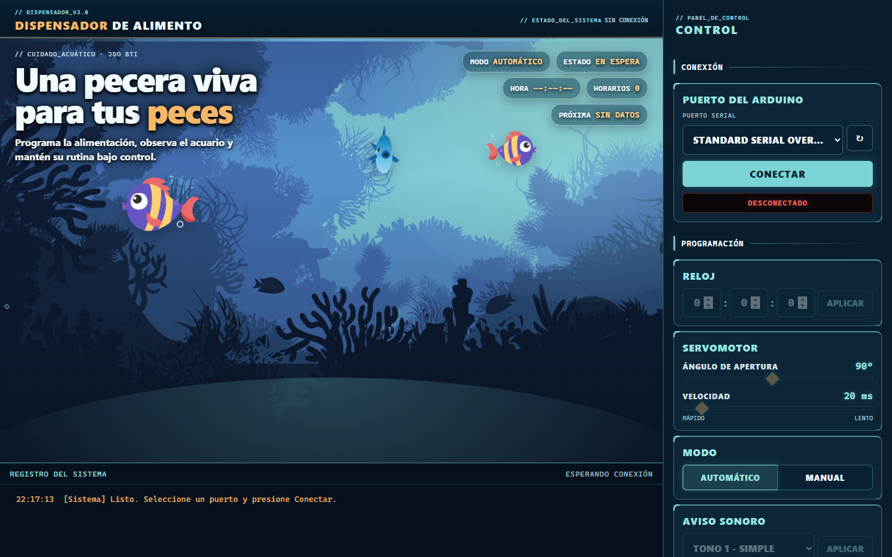
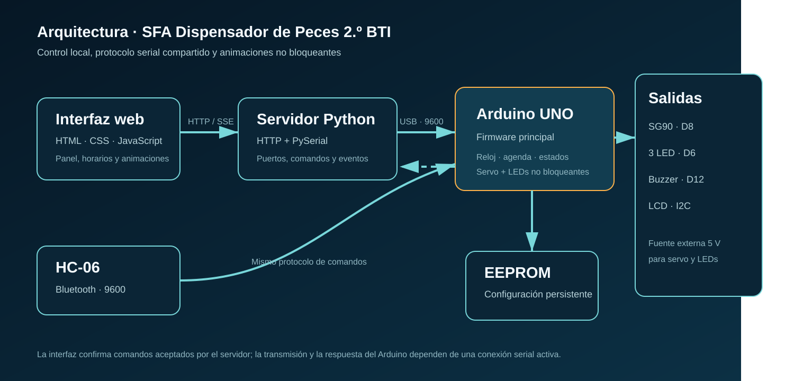
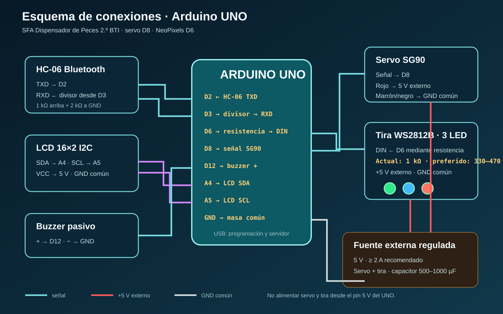

# SFA · Dispensador de peces — 2.º BTI


Prototipo educativo de alimentación programada para peces con **Arduino UNO**, servomotor, LCD, Bluetooth y una tira de tres NeoPixels. Incluye una interfaz web local para configurar horarios, intervalos, movimiento del servo y animaciones LED.



## Funciones principales

- Alimentación manual o automática por horario e intervalo.
- Servo SG90 en **D8**, con ángulo y velocidad configurables.
- Tira WS2812B/NeoPixel de **tres LEDs en D6**.
- Animaciones: apagada, radar, ola marina, arcoíris y pulso coral.
- Panel local con selección de puerto serial y registro de eventos.
- LCD 16×2 I2C, buzzer y enlace Bluetooth HC-06.
- Configuración persistente en EEPROM.

## Arquitectura



La página no controla el Arduino directamente. El navegador envía comandos al servidor Python; el servidor los transmite por USB serial a 9600 baudios. El HC-06 acepta el mismo protocolo desde un dispositivo Bluetooth.

## Esquema de conexiones



| Módulo | Conexión al Arduino UNO |
|---|---|
| Servo SG90, señal | D8 |
| Tira WS2812B, DIN | D6 mediante resistencia serie |
| Buzzer pasivo, positivo | D12 |
| HC-06 TXD → Arduino RX | D2 |
| Arduino TX → HC-06 RXD | D3 mediante divisor de tensión |
| LCD SDA / SCL | A4 / A5 |

El servo y la tira se alimentan con una **fuente externa regulada de 5 V**, con GND común al Arduino. La resistencia de 1 kΩ actualmente instalada está en la línea de datos: no regula el brillo. Puede funcionar con un conductor corto; 330–470 Ω es el rango preferido si aparecen parpadeos o colores erráticos.

Consulta [Montaje y pruebas](docs/MONTAJE_Y_PRUEBAS.md) antes de energizar el prototipo.

## Software necesario

- Arduino IDE o Arduino CLI con `arduino:avr`.
- Bibliotecas `Servo`, `LiquidCrystal I2C` y `Adafruit NeoPixel`.
- Python 3.10 o superior con `pyserial`.

Instalación con Arduino CLI:

```sh
arduino-cli core update-index
arduino-cli core install arduino:avr
arduino-cli lib install "Servo" "LiquidCrystal I2C" "Adafruit NeoPixel"
```

## Compilar el firmware

```sh
arduino-cli compile --fqbn arduino:avr:uno SFA_Dispensador_Peces_2BTI
```

## Ejecutar la interfaz

En Windows puede utilizarse `server/run.bat`. De forma manual:

```sh
python -m pip install -r server/requirements.txt
python server/server.py
```

El servidor abre `http://127.0.0.1:8765`. Si ese puerto está ocupado, busca automáticamente el siguiente disponible sin cerrar servidores ajenos.

## Comandos relevantes

```text
SET HORA HH:MM:SS
SET ANGULO 10..180
SET VELOCIDAD 5..200
SET MODO AUTO|MANUAL
SET TONO 1..3
SET ANIMACION 0..4
ADD HORA HH:MM
DEL HORA N
CLEAR HORAS
SET INTERVALO H:M:S
DISPENSAR
ESTADO
AYUDA
```

## Evidencia disponible

Comprobación local del **8 de octubre de 2026**:

| Evidencia | Resultado |
|---|---|
| Compilación Arduino UNO | Correcta |
| Flash | 20.070 B de 32.256 B · 62 % |
| RAM estática | 926 B de 2.048 B · 45 % |
| Sintaxis Python y JavaScript | Correcta |
| Servidor HTTP y listado de puertos | Verificados localmente |
| Renderizado de la interfaz | Verificado y capturado |
| Prueba física prolongada | Pendiente |

La compilación, el servidor y la captura verifican el software; **no prueban por sí solos** la estabilidad eléctrica, el caudal de alimento, el torque del servo ni el funcionamiento continuo del montaje real.

## Organización

```text
SFA_Dispensador_Peces_2BTI/   firmware principal
server/                       puente HTTP/serial e interfaz
docs/                         esquemas, montaje y pruebas
tools/                        comprobaciones de sintaxis
.github/workflows/            verificación automática
```

## Uso y autoría

Este repositorio se publica como demostración educativa y portafolio técnico. No se ha concedido una licencia abierta de redistribución, modificación o explotación comercial del código propio. Las dependencias conservan sus licencias originales.
